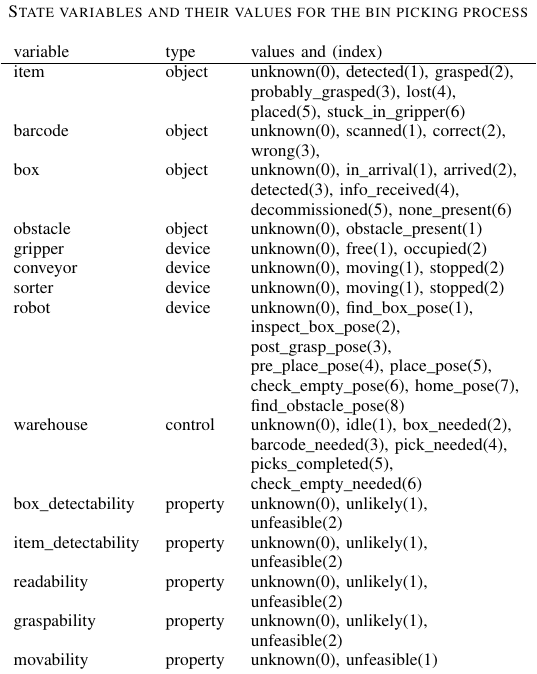

# Convert PRISM file to a PDDL domain and problem

The script `prism2pddl.py` will call the other tools in this directory to 
convert from PRISM to PDDL. It will remove and overwrite some files in the 
directory you run it in so be careful!

## Setup

### ePMC
One requirement for this script not included in this repo is the extendible
Probabilistic Model Checker (ePMC). It converts from PRISM to JANI. Clone and compile the standard
distribution according to this guide:

https://github.com/ISCAS-PMC/ePMC/wiki/Build-ePMC-under-Debian-based-Linux-Distributions

Optional: add `prepare_plugin prism-exporter` as the second to last line
in the file `ePMC/distributions/standard/build.sh` before building. Thus, you
can also use ePMC to convert from JANI to PRISM

After installing ePMC, tell `prism2pddl.py` where to find it.
Update the path in line 35 with ePMC's root directory.
Do include the slash in the end, e.g.
``` python
epmc_path = "~/ePMC/"
```

### Python
Make sure you have Python 2.7 and 3.X as well as their respective pip versions installed.
The following commands should not result in errors:
``` bash
python2 --version
pip2 --version
python3 --version
pip3 --version
```

### regex
Supports more powerful regular expressions than Python's `re` library
``` bash
pip3 install regex --user
```

### sympy
Dependency of the `jani2ppddl` program
``` bash
pip2 install sympy
```

## Execute it

Run with Python 3 from the "pddl_converter" directory, copy the
following line to your bash:
``` bash
cd ~/pddl_converter
python3 prism2pddl.py --input saint10_non-deterministic.prism
```

Then check if the plan, that `Metric-FF` finds, makes sense.
``` bash
cat solution_auto.txt  
```

## Which artifacts are created?

Have a look in the PDF `pddl_pipeline.pdf` to see all artifacts.
The PRISM model on the left is the file `saint10_non-deterministic.prism` in this repo.
You will see multiple versions of the generated files with the suffixes `auto`, `semi`, etc.
They indicate what autonomy level the recovery actions will have.
Adjust the number of autonomy levels by shortening the list on line 36 of `prism2pddl.py`.
The default is:
``` python
levels = ["tele", "semi", "auto", "all"]
```

## What do all the numbers mean?

See this table for reference:



## Credits

This repo includes code from and exeutables from Uni Saarland. In specific, those are:

* `ppddl2jani` and `jani2ppddl` by Michaela Klauck, supplemental material from [this journal article](https://jair.org/index.php/jair/article/view/11595)
* [Metric-FF v2.1](https://fai.cs.uni-saarland.de/hoffmann/metric-ff.html) by Jörg Hoffmann
